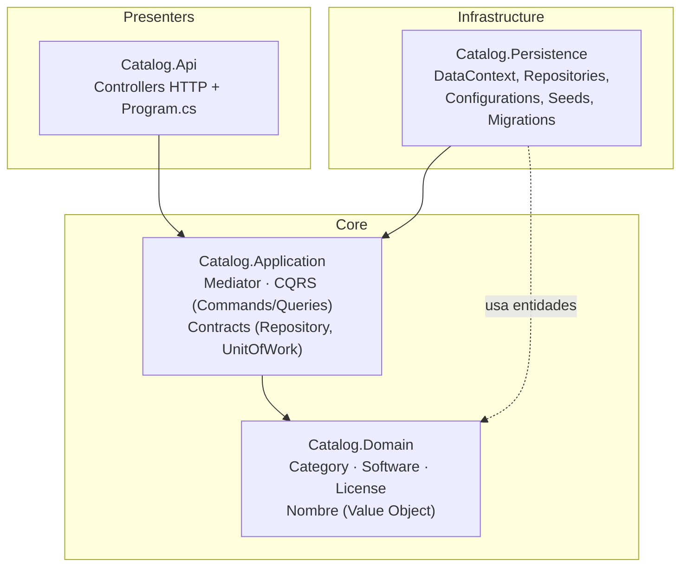

# Catalog Microservice — Sistema de Préstamo de Licencias

## Integrantes del equipo

- [Maria Paula Carmona Rojas] 
- [Manuela Sanchez Pareja] 
- [Sofia Ortiz Serna] 
- [Maria Paulina Vargas Lenis]
- [Mariana Suaza Serna]


Microservicio de **catálogo** para un sistema de préstamo de licencias de software. Administra la información de software disponible, sus categorías y las licencias prestables de cada uno.

Este es el **primer microservicio desacoplado** del proyecto completo (Identity/Auth, Catálogo, Préstamos, Pagos, Notificaciones), implementado aplicando **Clean Architecture** y **Domain-Driven Design (DDD)**.

## Responsabilidad de este microservicio

| Concepto | Descripción |
|---|---|
| **Category** | Agrupa software por tipo (ej. "Ofimática", "Diseño") |
| **Software** | Un producto de software, asociado a una categoría |
| **License** | Una unidad individual prestable de un software, con estado disponible/ocupada |

Este microservicio **no** maneja usuarios, préstamos ni pagos — esas responsabilidades corresponden a otros microservicios del sistema.

## Tecnologías

- .NET 10 / ASP.NET Core Web API
- Entity Framework Core + SQL Server
- Arquitectura CQRS con patrón Mediator (implementación propia)
- Swagger / OpenAPI para documentación interactiva
- Git Flow como flujo de trabajo colaborativo

## Arquitectura

El proyecto sigue Clean Architecture dividida en 4 capas, con las dependencias apuntando siempre hacia adentro:



**Regla de dependencia:** `Domain` no depende de nada. `Application` solo depende de `Domain`. `Persistence` y `Api` dependen de `Application` (y conocen `Domain` solo para usar sus entidades/mapear EF Core). Ninguna capa interna conoce a las externas.

### Patrones de diseño aplicados

| Patrón | Dónde | Propósito |
|---|---|---|
| **Repository** | `IRepository<T>`, `ISoftwareRepository`, etc. | Abstraer el acceso a datos; Application no sabe que hay SQL Server detrás |
| **Unit of Work** | `IUnitOfWork` / `EFCoreUnitOfWork` | Agrupar cambios y confirmarlos (`CommitAsync`) en una sola transacción |
| **Mediator** | `IMediator` / `SimpleMediator` | Desacoplar el Controller del UseCase que resuelve la petición, vía reflection + DI |
| **CQRS** | Carpetas `Commands/` y `Queries/` | Separar físicamente operaciones de escritura y lectura |
| **Factory (Value Objects)** | `Nombre` (record) | Garantizar que el objeto nunca exista en estado inválido |
| **Dependency Injection** | `ApplicationServicesRegistry`, `PersistenceServicesRegistry` | Las clases reciben sus dependencias (interfaces) desde afuera |

## Modelo de dominio

```
Category (1) ──── tiene muchos ────> Software (N)
Software (1) ──── tiene muchas  ────> License (N)
```

- **Category**: `Id`, `Nombre` (Value Object)
- **Software**: `Id`, `Nombre` (Value Object), `CategoryId`, `Category` (navegación)
- **License**: `Id`, `SoftwareId`, `Software` (navegación), `IsAvailable`
  - Comportamiento: `Assign()` (marca como ocupada, falla si ya no está disponible), `Release()` (marca como disponible)

Las reglas de negocio viven dentro de las entidades (ej. `Software` valida que `CategoryId` no sea `Guid.Empty`; `Nombre` valida longitud máxima de 100 caracteres), no en los controllers ni en los casos de uso.

## Casos de uso implementados (CQRS)

### Software

| Tipo | Caso de uso | Endpoint |
|---|---|---|
| Query | Listar todo el software (paginado) | `GET /api/software` |
| Query | Consultar software por Id | `GET /api/software/{id}` |
| Query | Consultar software por categoría | `GET /api/software/category/{categoryId}` |
| Command | Crear software | `POST /api/software` |
| Command | Registrar licencias para un software | `POST /api/software/{softwareId}/licenses` |

### Category

| Tipo | Caso de uso | Endpoint |
|---|---|---|
| Query | Listar categorías (paginado) | `GET /api/category` |
| Command | Crear categoría | `POST /api/category` |

### License

| Tipo | Caso de uso | Endpoint |
|---|---|---|
| Query | Listar licencias (paginado) | `GET /api/license` |

## Estructura de carpetas

```
Catalog.slnx
├── Core/
│   ├── Catalog.Domain/
│   │   ├── Entities/ (Category, Software, License)
│   │   ├── Common/ValueObjects/ (Nombre)
│   │   └── Exceptions/ (BussinesRuleException)
│   └── Catalog.Application/
│       ├── Contracts/
│       │   ├── Repositories/ (IRepository, ICategoryRepository, ISoftwareRepository, ILicenseRepository)
│       │   └── Persistence/ (IUnitOfWork)
│       ├── UseCases/
│       │   ├── Software/Commands/ (CreateSoftware, RegisterLicenses)
│       │   ├── Software/Queries/ (GetSoftwareList, GetSoftwareById, GetSoftwareByCategory)
│       │   ├── Categories/Commands/ (CreateCategory)
│       │   ├── Categories/Queries/ (GetCategoriesList)
│       │   └── License/Queries/ (GetLicenseList)
│       ├── Utilities/
│       │   ├── Mediator/ (IMediator, IRequest, IRequestHandler, SimpleMediator)
│       │   └── Pagination/ (PaginationRequest, PaginationResponse)
│       └── Exceptions/ (MediatorException)
├── Infrastructure/
│   └── Catalog.Persistence/
│       ├── Configurations/ (Fluent API de EF Core)
│       ├── Repositories/ (implementaciones concretas)
│       ├── UnitOfWorks/ (EFCoreUnitOfWork)
│       ├── Seeds/ (datos de prueba)
│       ├── Migrations/
│       ├── DataContext.cs
│       └── Extensions/ (ApplicationServicesRegistry, PersistenceServicesRegistry)
├── Presenters/
│   └── Catalog.Api/
│       ├── Controllers/ (SoftwareController, CategoryController, LicenseController)
│       └── Program.cs
└── Tests/
    └── Catalog.Tests/
```

## Cómo ejecutar el proyecto

### Requisitos previos

- .NET 10 SDK
- SQL Server (local, ej. SQL Server Express)
- Herramienta `dotnet-ef`:
  ```bash
  dotnet tool install --global dotnet-ef
  ```

### 1. Clonar el repositorio

```bash
git clone https://github.com/PaulaCr202/Sistema_Prestamo_Licencias.git
cd Sistema_Prestamo_Licencias
```

### 2. Configurar la conexión a tu base de datos local

Edita (o crea) `Catalog.Api/appsettings.Development.json` con tus propios datos de SQL Server:

```json
{
  "ConnectionStrings": {
    "CatalogDb": "Server=TU_SERVIDOR\\SQLEXPRESS;Database=CatalogDb;Trusted_Connection=True;TrustServerCertificate=True"
  }
}
```

> ⚠️ Esta configuración es local de cada desarrollador.

### 3. Aplicar las migraciones

Desde la raíz de la solución:

```bash
dotnet ef database update --project Catalog.Persistence --startup-project Catalog.Api
```

Esto crea la base de datos `CatalogDb` con las tablas `Categories`, `Softwares` y `Licenses`.

### 4. Ejecutar la aplicación

```bash
dotnet run --project Catalog.Api/Catalog.Api.csproj
```

Al arrancar, el `DataBaseSeeder` puebla automáticamente datos de prueba (5 categorías, 5 software, 3 licencias por software) si la base de datos está vacía.

### 5. Probar los endpoints

Con la aplicación corriendo, abre en el navegador:

```
http://localhost:{PUERTO}/swagger
```

(el puerto exacto aparece en la consola al ejecutar `dotnet run`)

Desde ahí puedes usar **"Try it out"** en cualquier endpoint para ejecutarlo directamente desde el navegador.

## Flujo de trabajo con Git

El equipo trabaja bajo **Git Flow**:

- `main`: versión estable, lista para entregar.
- `develop`: rama de integración, donde se fusionan todas las features antes de pasar a `main`.
- `feature/...`: una rama por tarea/persona, creada desde `develop`, integrada vía Pull Request con revisión de al menos un compañero antes del merge.
